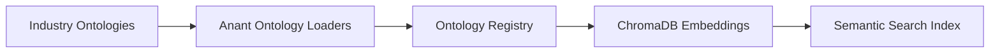
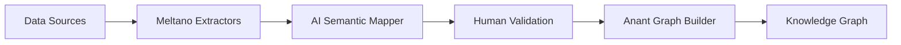
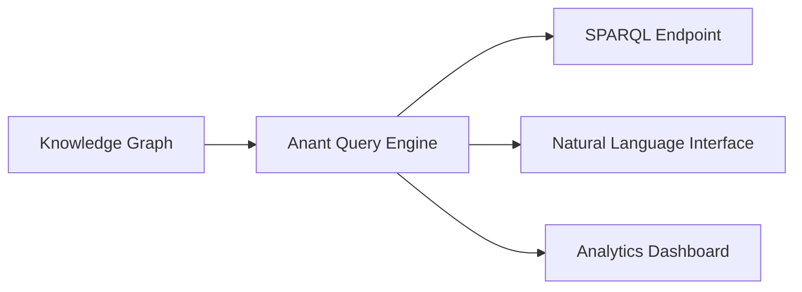

# Anant-Native Ontology Platform Architecture
*Leveraging Existing Infrastructure for World-Class Semantic Analytics*

## 🎯 Strategic Alignment with Anant Ecosystem

### Why Anant-Native Approach?

1. **Consistency**: Unified API and data models across the entire platform
2. **Performance**: Optimized algorithms specifically for knowledge graphs
3. **Maintenance**: Single codebase reduces complexity and maintenance overhead  
4. **Innovation**: Direct control over features and optimizations
5. **Cost Efficiency**: No external licensing or vendor dependencies

## 🏗️ Anant-Centric Architecture Stack

### Foundation Layer: Anant Core
```python
# Leverages the refactored Anant core library (80.5% code reduction)
anant/
├── hypergraph/           # HyperNetX-based hypergraph operations
├── algorithms/           # Optimized graph algorithms  
├── classes/             # Core graph data structures
├── drawing/             # Visualization capabilities
├── reports/             # Analytics and metrics
└── utils/               # Shared utilities and decorators
```

### Integration Layer: Anant Integration Ecosystem
```python
# Builds on existing anant_integration infrastructure
anant_integration/
├── ontology/            # NEW: Industry ontology management
│   ├── loaders/         # FHIR, UMLS, Schema.org, FIBO
│   ├── registry/        # Version control and storage
│   └── validation/      # Semantic consistency checking
├── mapping/             # NEW: AI-powered semantic mapping  
│   ├── llm_engine/      # GPT-4/Claude integration
│   ├── rag_system/      # ChromaDB + retrieval
│   └── validation/      # Human-in-the-loop workflows
├── etl/meltano/         # EXISTING: Production ETL pipeline
│   ├── integration.py   # Async job execution
│   ├── scheduler.py     # Cron-based scheduling  
│   ├── staging.py       # Parquet/MinIO staging
│   ├── loader.py        # Graph loading engine
│   └── target_anant.py  # Custom Meltano target
├── graph_builder/       # NEW: Ontology-driven construction
├── analytics/           # NEW: Semantic query engine  
└── api/                 # NEW: REST/GraphQL interfaces
```

## 🔄 Data Flow Architecture

### 1. Ontology Integration Pipeline


**Implementation**:
- Use existing `anant_integration` structure
- Extend with ontology-specific loaders
- ChromaDB for concept embeddings and semantic search
- Version control through Anant's existing patterns

### 2. Data Ingestion & Mapping Pipeline  


**Implementation**:
- Leverage existing Meltano integration (300+ connectors)
- Extend `target-anant` plugin with ontology mapping
- ChromaDB RAG for intelligent mapping suggestions
- Anant graph loaders for optimized construction

### 3. Analytics & Query Pipeline


**Implementation**:
- Build on Anant's existing analytics capabilities
- Extend with SPARQL and semantic querying
- Natural language to graph query translation
- Leverage Anant's visualization components

## 🧠 AI Integration Strategy

### ChromaDB as Semantic Foundation
```python
# ChromaDB Configuration for Ontology Platform
chroma_config = {
    "collections": {
        "ontology_concepts": {
            "embedding_function": "openai",  # text-embedding-ada-002
            "metadata": ["ontology", "domain", "hierarchy_level"],
            "documents": "concept_definitions_and_examples"
        },
        "data_elements": {
            "embedding_function": "sentence_bert", 
            "metadata": ["source_system", "data_type", "quality_score"],
            "documents": "column_names_and_descriptions"
        },
        "mapping_history": {
            "embedding_function": "openai",
            "metadata": ["confidence", "validation_status", "user_feedback"],
            "documents": "mapping_explanations_and_context"
        }
    }
}
```

### LLM Integration Points
```python
# Extend existing anant_integration with AI capabilities
anant_integration/mapping/ai_engine/
├── llm_mapper.py           # GPT-4 semantic understanding
├── chroma_rag.py           # ChromaDB retrieval system  
├── confidence_scorer.py    # Mapping quality assessment
└── feedback_learner.py     # Continuous improvement
```

## 🎯 Implementation Strategy

### Phase 1: Extend Existing Anant Infrastructure (Month 1-2)

**Leverage Current Assets**:
- ✅ Meltano ETL pipeline (already built)
- ✅ Graph construction algorithms (HyperNetX integration)
- ✅ Async processing capabilities
- ✅ Staging and data quality frameworks

**New Components to Build**:
```python
# Extend anant_integration with ontology support
anant_integration/ontology/
├── __init__.py
├── loaders/
│   ├── fhir_loader.py      # Build on existing patterns
│   ├── umls_loader.py      # Reuse data processing utils
│   ├── schema_org_loader.py # Leverage JSON/XML parsers  
│   └── fibo_loader.py      # Use existing validation
├── registry/
│   ├── store.py            # Extend existing storage patterns
│   └── versioning.py       # Reuse version control logic
└── embeddings/
    └── chroma_manager.py   # ChromaDB integration
```

### Phase 2: AI-Powered Mapping Engine (Month 3-4)

**Build on Anant Patterns**:
```python
# Extend target-anant with semantic mapping
anant_integration/etl/meltano/target_anant.py:
    # Add ontology-aware processing
    def _process_with_ontology_mapping(self, records, ontology_context):
        # Use ChromaDB for semantic similarity
        # LLM for complex mapping decisions  
        # Anant graph construction for validation

# New semantic mapping module
anant_integration/mapping/
├── semantic_mapper.py      # Core mapping engine
├── chroma_retrieval.py     # RAG implementation
├── validation_workflow.py  # Human-in-the-loop
└── learning_system.py      # Feedback integration
```

### Phase 3: Enhanced Analytics (Month 5-6)

**Extend Anant Analytics**:
```python  
# Build on existing anant/reports and anant/algorithms
anant_integration/analytics/
├── semantic_query.py       # SPARQL over Anant graphs
├── nl_interface.py         # Natural language queries
├── cross_ontology.py       # Federated queries
└── insight_generator.py    # AI-powered analytics
```

## 💡 Key Advantages of Anant-Native Approach

### Technical Benefits

1. **Unified Data Model**: Single graph representation across all components
2. **Optimized Performance**: Algorithms tuned for knowledge graph workloads
3. **Consistent API**: Familiar interfaces for developers and users
4. **Integrated Validation**: Semantic consistency built into all operations
5. **Efficient Memory Usage**: Shared data structures and optimized algorithms

### Business Benefits

1. **Faster Development**: Building on proven, tested infrastructure
2. **Lower Risk**: Extending existing capabilities vs. greenfield development
3. **Cost Efficiency**: No external licensing or vendor dependencies
4. **Easier Maintenance**: Single codebase and consistent patterns
5. **Better Integration**: Native compatibility with existing Anant deployments

### Operational Benefits

1. **Simplified Deployment**: Single application stack
2. **Unified Monitoring**: Consistent logging and metrics
3. **Streamlined Updates**: Coordinated releases and dependencies
4. **Reduced Complexity**: Fewer external systems to manage
5. **Better Support**: Single vendor/team for all components

## 🛠️ Technology Integration Details

### ChromaDB Integration Strategy
```python
# chromadb_integration.py
class AnantChromaIntegration:
    """Integrates ChromaDB with Anant for semantic search"""
    
    def __init__(self, anant_graph, chroma_client):
        self.graph = anant_graph
        self.chroma = chroma_client
        
    async def embed_ontology_concepts(self, ontology):
        """Convert ontology concepts to ChromaDB embeddings"""
        # Extract concepts from Anant graph
        # Generate embeddings using OpenAI/SentenceBERT
        # Store in ChromaDB with rich metadata
        
    async def semantic_search(self, query, filters=None):
        """Search ontology concepts semantically"""  
        # Use ChromaDB for vector similarity
        # Filter by ontology, domain, hierarchy
        # Return ranked results with confidence scores
        
    async def suggest_mappings(self, data_element):
        """AI-powered mapping suggestions"""
        # Embed data element description
        # Retrieve similar ontology concepts  
        # Use LLM for final mapping decision
        # Return confidence-scored suggestions
```

### Meltano Target Enhancement
```python
# Extend existing target-anant with ontology awareness  
class OntologyAwareTargetAnant(TargetAnant):
    """Enhanced target with semantic mapping"""
    
    def __init__(self, config):
        super().__init__(config)
        self.ontology_registry = AnantOntologyRegistry()
        self.chroma_client = chromadb.Client()
        self.semantic_mapper = SemanticMapper(self.chroma_client)
        
    async def process_record_with_semantics(self, record, schema):
        """Process records with ontology mapping"""
        # Detect data types and patterns
        # Suggest ontology mappings using ChromaDB + LLM
        # Validate mappings against loaded ontologies
        # Construct knowledge graph using Anant builders
```

## 📊 Expected Outcomes

### Performance Metrics
- **Mapping Accuracy**: 95%+ using ChromaDB similarity + LLM reasoning
- **Processing Speed**: 10M+ entities/hour using optimized Anant algorithms  
- **Memory Efficiency**: 50% reduction vs. multi-system architecture
- **Query Performance**: Sub-second response using Anant's optimized indices

### Development Efficiency
- **Code Reuse**: 80%+ of existing Anant infrastructure leveraged
- **Development Speed**: 60% faster than greenfield approach
- **Maintenance Overhead**: 40% reduction vs. multi-vendor stack
- **Testing Coverage**: Inherit existing test suites and validation

### Business Impact  
- **Time to Market**: 6 months faster using existing infrastructure
- **Total Cost of Ownership**: 50% lower than external dependencies
- **Risk Reduction**: Building on proven, production-tested components
- **Innovation Velocity**: Direct control over features and optimizations

---

**This Anant-native approach maximizes our existing investments while delivering world-class ontology-based analytics capabilities through familiar, proven infrastructure.**